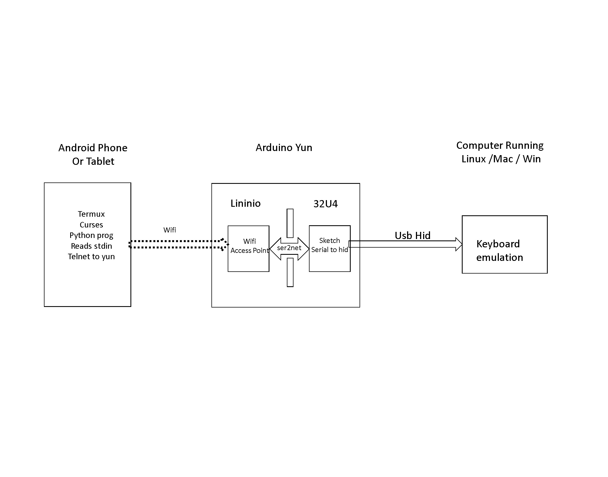
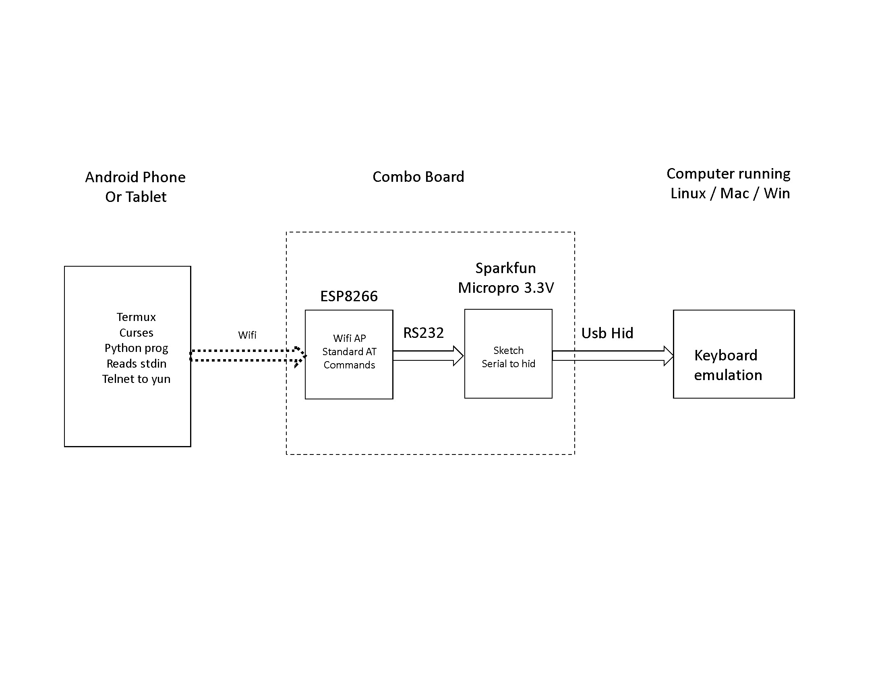
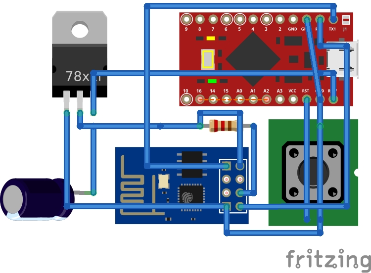
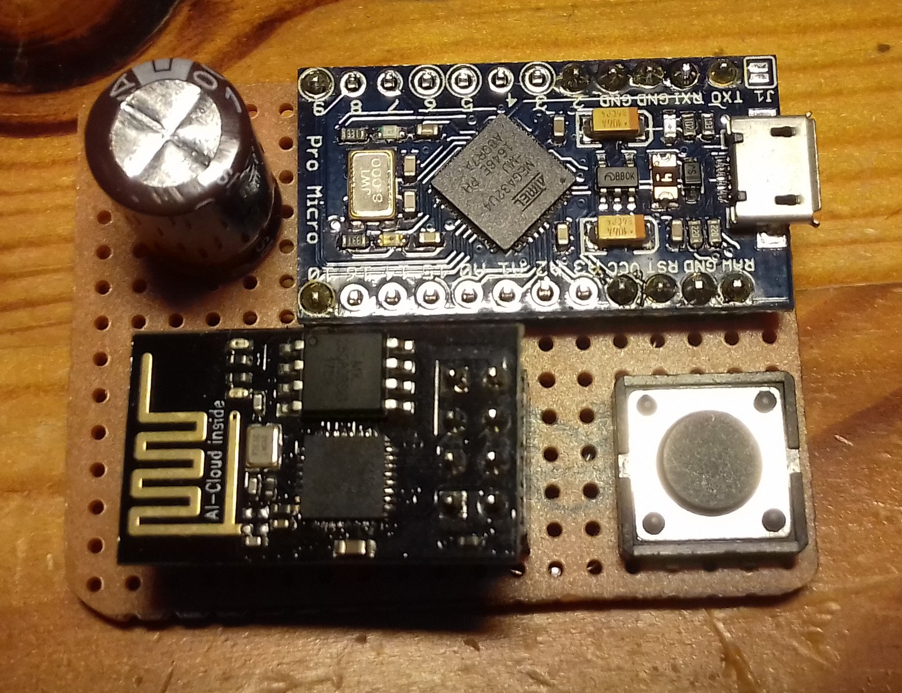
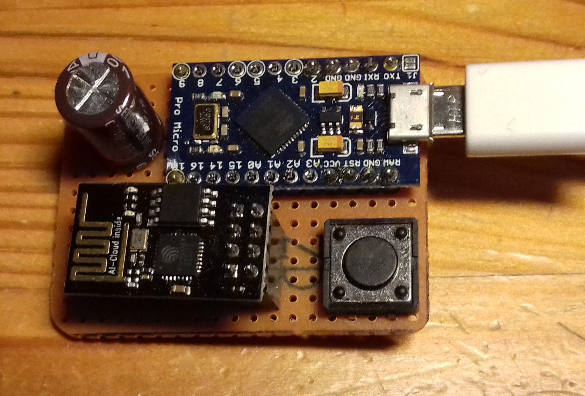
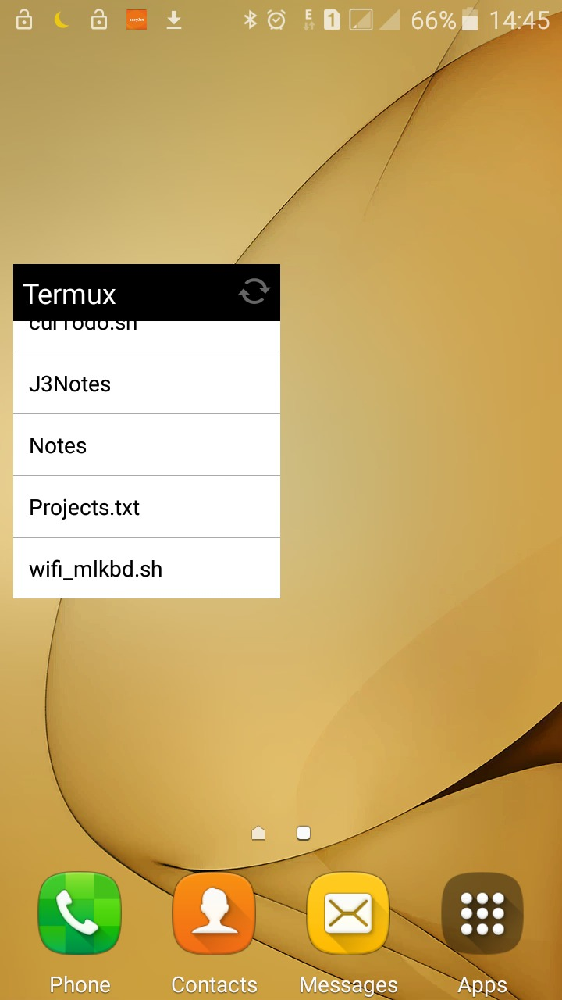
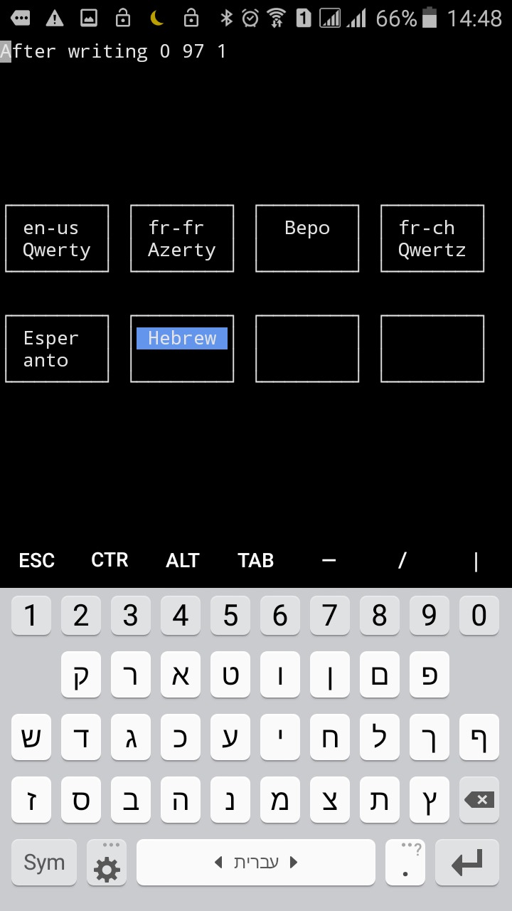

/

#Créez un clavier Wifi Multi Langues {align=center}

<p align="justify"> 

##Vous avez toujours rêvé d’avoir un vrai clavier multi langues, connecté en wifi ?

##Azerty Qwerty Cyrillique, mais aussi Dvorak, Bepo et pourquoi pas  Grec Arabe  ….  Vous devez utiliser plusieurs claviers, un par langue ou par groupe de langue, et vous en avez marre de cette accumulation de claviers et de câbles ? pourquoi ne pas profiter du vaste choix de claviers internationaux disponible en standard sur tout téléphone ou tablette Android ?

##Et pour la connexion, utilisez le wifi.

</p>  


#USB Keyboard Emulator for PC Using a Micro Pro


```
##Todo
\begin{center}
Create a colorful native Android application
\end{center}
->Pictures board only, connectivity<-
Check power requirements - micro-pro over heating
```

#Objectives   

Provide a true multi language keyboard for text input
Use the availability of multiple keyboard layouts on any Android device, and convert a key stroke on the tablet or phone to a USB HID equivalent key sent to the target device (usually a PC)
All languages available in Android are easily available. All that needs to be done is create a lookup table for converting a utf-8 character value to the corresponding key 

Available for Linux, Mac and Windows


But there are many other usage cases:
- Use an android phone as a usb keyboard for a PC. Linux, Mac or Windows
- Use a tablet as a multi language keboard emulator (much cheaper than a projection keyboard)

#Design Approach
Configure an ESP8266 Pro as a Wifi Access Point
Connect the tablet or phone to the ESP8266 wifi access point
Run a dedicated program on the tablet or phone. this program receives UTF-8 code of the characters entered on the keyboard.
Convert this UTF-8 code into the key that is used to produce the character, and send the information to the ESP8266 / Micro Pro combo
The ESP8266 simply passes the information to the Micro Pro.
The Micro Pro simutlates a press / release of the specified key.
There is no code to update on the ESP8266. The code on the Micro Pro is very simple, and does not need to be updated for supporting a new Keyboard Layout.
The intelligence is in the program running on the phone / tablet. This program must be aware of the desired keyboard, and for each layout, translate the character to the relevant key position


#Supported Layouts 
This is a work in progress. At the moment, only the US and Hebrew keyboards are supported
All european languages are planned to be suppoorted soon.
It is unclear at this point if Japanese, Chinese and Korean can be supported.

#Key Handling  
The current objective of this project is to allow to easily enter text in various keyboard layouts, using alphabetic, numeric, and punctuation characters. 
The objecive is not to support power usage of key combination on the keyboard (emac users ?) Typing on a glass is not very user friendly, 
and not meant to replace a 10 euros keyboard with movin keys
The current termux / curses program only receives the ascii / utf-8 character code, not the detail of the keys used to produce the character. 
This is what is sent to the main workstation     
Using a native Android application, it should be possible (not checked) to enhance the key support, and separately handle the individual key press and key release,
making it possible to support any key combination


```

```

#Architecture


##Hardware Architecture - Arduino Yun

For the prototype, I used an Arduino Yun. It has all the hardware in a single unit, and only needs one cable from the target PC for Power + USB HID emulation
Pros: 
Advantage is the flexibility. the linux part offers the Wifi Access Point.
ser2net passes the Ascii string from the wifi to the 32U4 part of the Yun. It is very easy to get started
The tablet or phone connects to the Yun via Wifi. The setup is light weight and easy

Cons:
Cost around 70 Euros
Time to boot 90 seconds

##Hardware Architecture - ESP8266 and Sparksun Micropro 3.3V

For distributing samples for testers, I created a small board with an ESP8266 for the Wifi Access Point, and an Sparkfun Pro Micro for the HID emulation on USB
Single cable for powering the combo, and the USB HID
Fast boot (less than 10 seconds)
Low cost - 8 euros for the Pro Micro, 2 euros for the ESP8266
ESP8266 is powered from the 3.3 Volts provided by the Pro Micro on the "Raw" pin. Most articles will tell you to not do this, 
as the ESP8266 cant take 250 mAmp in peak. But the experience shows thhat it works perfectly.



###Power Requirements
ESP8266 is powered from the 3.3 Volts provided by the Pro Micro on the "Raw" pin. Most articles will tell you to not do this, 
as the ESP8266 cant take 250 mAmp in peak. But the experience shows thhat it works perfectly. To be on the safe side, I added a 1000 microfarad capacitor on the line





##Schematic

##Software Architecture 

The software achitecture is very similar with the Yun and ESP8266. 
A Python program runs under Termux on the android device
The phone is a client to the Wifi access point provided either by the Yun or by the ESP8266
In the case of the Yun, the Linino part runs the standard ser2net program, which simply transfers the data received over telnet to the 32U4 part of the Yun
In the case of the ESP8266, the original firmware is used. The micropro drives the ESP8366 using standard AT commands, and receives the data through RS232 
The 32U4 part of the Yun, or the micropro itself tansforms the key code value in ascii to a key press using the HID Keyboard library


###PYthon Program running on Termux
I chose Termux running on Android for the ease of programming. There is no real requirement for a user interface.
Only user interface requirement is the indication of the current layout.
A later version, preferrably running natively on Android, should be able to automatically identify the keyboard layout. This may be possible as well on Termux.

###ESP8266 Pass Though
As said above, there is not custom code running on the ESP8266, Standard AT commands are exectuted from the micropro to initialise the Access Point, and start the telnet server on port 8888.
The micropro receives the data from the ESP8266. All data is exchanged using RS232

###Arduino Sketch 

#Installaton on Android device - Samsung J3 2016 - Android 5.1.1
Enable USB debugging on the phone. 
From the settings, Select About Phone ==> Software Information ==> Build Number
Tap "Build Number" several times, until the message appears "You are now x steps away from enabling "Developer options"
Back to the Settings menu, there is now a new "Developer option". Select it, and enable "USB Debugging"

From the playstore (or FDroid), install termux    
From the termux shell, install python
pkg install python
Validate that the installed version is at least 3.x with 
python --version
Python 3.6.6 

Install the coreutils package for various tools
pkg install corutils

Create a home and a bin directory on the internal phone storage
Rene
Rene/bin


Copy the file wifi_mlkbd.py to the new directory /storage/sdcard0/Rene/bin
for example with a usb cable and the command
adb push wifi_mlkbd.py /storage/sdcard0/Rene/bin

Create a shortcut
cd $HOME/.shortcuts

Create a file wifi_mlkbd.sh
killall wifi_mlkbd
sleep 1
python /storage/sdcard0/Rene/bin/wifi_mlkbd.py

Refresh the shortcuts icon on the home screen




#Supported Keyboard layouts 
This is a work in progress.   
At the moment, the Qwerty and Hebrew languages are supported
Azerty Bepo Qwertz (Fr-CH) Esperanto and Amharique are the todo list

#CJK - Chinese - Japanese - Korean Layouts   
I miss information and exposure to these keyboards. I think there are different keyboards and input methods for each of these languages. Support is clearly minimal at the moment.    
One thing that works (validated with Chinese and Japanese) is to use a standard Qwerty keyboard, and enter pinyin for the Chinese, or romaji for the japanese. 
The Input system will handle this as a normal Qwerty keyboard, and offer the corresponging Han character for Chinese, or Katakana, Hiragana, or Kanji for japanese.


##Usage

Connect the Combo board to a free port on the PC
On the first connection to a windows PC, the pc will recognize the arduino HID emulator, and load the driver. Confirmed with a sound
After a few seconds, the Combo will publish a wifi network AI-THINKER_xxxxxx. Connect the Android device to this network. this network is fully open at the moment.
Start the program under termux (from the command line, or from a shortcut)
python multi_lang_kbd.py    
Select the desired keyboard layout on the PC    
Select the same keyboard layout on the Android device    
Start typing !!    

Todo - Document changing layout on the android device



#Adding a Keyboard Layout
#Future developments

#pdf conversion   
```
pandoc -s -o wifi_mlkbd.pdf  -V geometry:"top=1cm, bottom=1cm, left=1cm, right=1cm" wifi_mlkbd.md
```
#github
https://github.com/rdubois440/wifi_mlkbd
